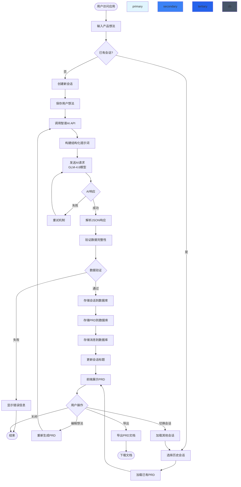
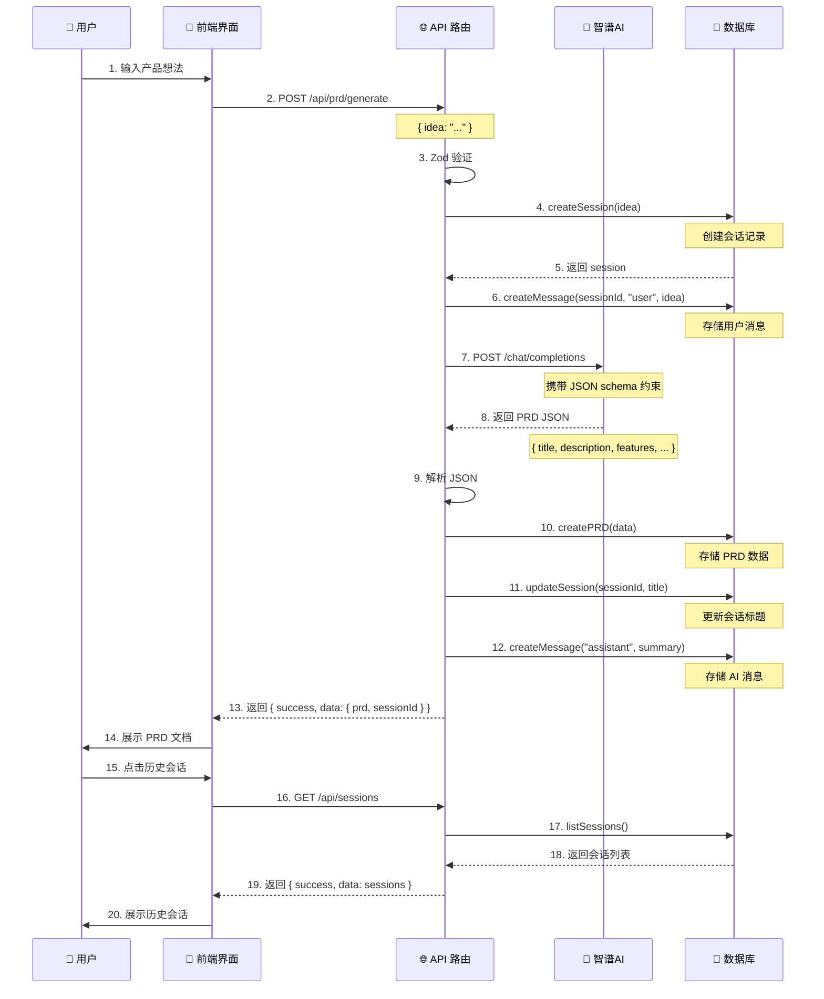

# AI PRD Agent - 产品需求文档

## 1. 产品概述

### 1.1 产品名称
AI PRD Agent

### 1.2 产品愿景
打造一款智能化产品需求文档生成工具，帮助产品经理和创业者快速、高效地将抽象的产品想法转化为结构化、可落地的专业 PRD 文档，降低产品定义阶段的认知负荷和协作成本。

### 1.3 核心价值主张
- **效率提升**：从构思到完整 PRD，由原来的 2-3 天缩短到 10-15 分钟
- **专业性保障**：AI 自动生成竞品分析、技术可行性评估、功能优先级排序等专业维度
- **结构化输出**：标准化的 PRD 模板，确保文档质量和可读性
- **历史管理**：完整的会话历史记录，支持版本追溯和迭代优化
- **成本优化**：利用 AI 能力替代部分专业咨询和竞品调研成本

---

## 2. 用户画像

### 2.1 主要用户群体

#### 用户画像 1：初级产品经理
- **基本信息**：小林，28岁，0-2 年经验，互联网公司产品经理
- **使用场景**：负责多个产品线的需求收集和文档撰写，需要在快速迭代中产出高质量 PRD
- **核心痛点**：
  - 缺乏竞品调研经验，不知道如何开展全面的竞品分析
  - 技术评估依赖研发团队，沟通成本高、反馈周期长
  - PRD 模板不够完善，遗漏关键章节导致返工
  - 功能优先级排序主观性强，缺乏数据支撑
- **期望价值**：快速生成专业 PRD，减少跨部门沟通时间，提升产品文档质量

#### 用户画像 2：创业者/产品负责人
- **基本信息**：小王，35岁，创业公司创始人/产品负责人
- **使用场景**：需要向投资人、开发团队、设计师传达产品想法和需求，文档质量直接影响融资和协作效率
- **核心痛点**：
  - 技术背景薄弱，对技术可行性缺乏准确判断
  - 时间紧迫，需要在有限时间内完成多个竞品分析
  - 缺乏标准化的 PRD 格式，文档可读性差
  - 频繁调整产品方向，需要快速更新文档
- **期望价值**：获得专业的产品文档支撑，增强团队沟通效率，提高投资人信心

#### 用户画像 3：自由产品顾问
- **基本信息**：小陈，32岁，独立产品顾问，服务多个初创公司
- **核心痛点**：
  - 需要快速响应客户需求，传统撰写方式效率低
  - 客户预算有限，无法承担高昂的咨询费用
  - 需要展示专业能力以获得客户信任
- **期望价值**：通过 AI 能力提升交付效率，扩大服务客户范围

### 2.2 次要用户群体

#### 用户画像 4：高校产品专业学生
- **基本信息**：小李，22岁，产品设计/工业设计专业学生
- **使用场景**：完成课程项目、毕业设计、竞赛作品集等
- **核心痛点**：
  - 对 PRD 结构不熟悉，不知道包含哪些内容
  - 缺乏实际项目经验，难以评估技术可行性
  - 参考资料分散，难以快速学习
- **期望价值**：学习 PRD 撰写规范，获得专业指导

---

## 3. 用户痛点

### 3.1 核心痛点分析

1. **信息收集效率低**
   - 竞品调研需要逐个访问网站、下载 APP、体验功能
   - 技术评估依赖多方沟通，信息不对称
   - 平均每个 PRD 需要耗费 4-8 小时调研时间

2. **文档结构不规范**
   - 缺乏统一的 PRD 模板，文档格式混乱
   - 关键章节缺失（如技术可行性、数据指标等）
   - 团队成员对文档理解不一致

3. **功能优先级决策困难**
   - 依赖个人经验和主观判断，缺乏量化依据
   - 难以在有限资源下做出最优决策
   - 优先级调整缺乏数据支撑

4. **技术评估门槛高**
   - 产品经理技术背景薄弱，难以准确评估开发难度
   - 技术方案选择缺乏专业指导
   - 可能导致需求过度或技术方案不当

5. **协作和版本管理困难**
   - 文档版本混乱，难以追溯修改历史
   - 多人协作时合并冲突
   - 文档丢失风险

6. **成本和资源限制**
   - 专业咨询费用高昂（小时计费 500-1000 元）
   - 初创团队预算有限，无法承担外部咨询
   - 时间成本机会成本高

---

## 4. 核心价值

### 4.1 价值主张矩阵

| 价值维度 | 传统方式 | AI PRD Agent | 提升幅度 |
|---------|---------|--------------|---------|
| **文档生成时间** | 2-8 小时 | 10-15 分钟 | **80-90%** |
| **竞品调研** | 4-16 小时 | 2-5 分钟 | **90%** |
| **技术评估** | 1-3 天 | 实时完成 | **95%** |
| **文档质量** | 依赖个人水平 | 专业模板+AI | **一致性提升** |
| **功能优先级** | 主观判断 | RICE 评分 | **量化决策** |
| **历史追溯** | 手动管理 | 自动存储 | **100%** |

### 4.2 核心价值

1. **极速生成**：基于大语言模型，在 1 分钟内完成专业 PRD 初稿
2. **智能洞察**：自动识别产品关键要素，补充遗漏章节
3. **数据驱动**：基于 RICE 方法论进行功能优先级排序
4. **技术专业**：提供详尽的技术可行性分析和挑战识别
5. **竞品智能**：自动抓取和整合竞品信息，生成差异化分析
6. **可追溯性**：完整的会话历史，支持版本对比和迭代优化
7. **成本优化**：单次使用成本远低于专业咨询费用
8. **学习成长**：通过查看 AI 生成的 PRD，学习专业文档写法

---

## 5. 产品流程图



### 产品流程详解

1. **用户访问阶段**
   - 用户打开应用，加载会话历史列表
   - 展示欢迎界面和功能引导

2. **输入阶段**
   - 新建 PRD：用户在文本框中输入产品想法（最少 10 字符）
   - 选择模板：提供快速开始选项（示例想法）
   - 生成触发：点击"生成 PRD"按钮

3. **AI 处理阶段**
   - 请求构建：基于模板构建包含完整字段的系统提示词
   - API 调用：向智谱 AI GLM-4.6 发送结构化请求
   - 格式控制：强制 JSON 响应格式确保数据完整性
   - 重试机制：API 失败自动重试 3 次

4. **数据处理阶段**
   - JSON 解析：解析 AI 返回的 PRD JSON 结构
   - 完整性校验：验证必需字段（标题、描述、功能等）
   - 错误处理：解析失败时提取 JSON 片段

5. **存储阶段**
   - 会话存储：创建 Session 记录，关联初始标题
   - PRD 存储：将完整 PRD 数据存储为 JSON 字段
   - 消息存储：记录用户输入和 AI 输出
   - 索引更新：创建 PRD 关联索引

6. **展示阶段**
   - 结构化渲染：使用 PRDViewer 组件分章节展示
   - 视觉优化：使用卡片、徽章等 UI 元素增强可读性
   - 交互设计：支持折叠/展开、复制等操作

7. **操作阶段**
   - 重新生成：基于当前想法重新生成 PRD
   - 会话切换：在历史记录中切换查看
   - 导出功能：支持导出为 PDF/Markdown（待实现）
   - 删除操作：删除不需要的会话和 PRD

---

## 6. 功能详细列表

### 6.1 核心功能 (MVP)

#### 功能 1：PRD 智能生成
- **优先级**：P0（必须）
- **工作量**：5/5
- **用户价值**：5/5
- **功能描述**：
  用户输入产品想法后，系统自动生成包含以下章节的完整 PRD：
  - 产品概述（标题、描述、背景）
  - 目标用户画像（主要/次要用户）
  - 用户痛点分析
  - 核心价值主张
  - 功能列表（含优先级、工作量、验收标准）
  - 成功指标定义
  - 技术可行性评估
  - 竞品分析

- **验收标准**：
  - [ ] 输入 50 字符以上的产品想法，在 30 秒内生成响应
  - [ ] 生成的 PRD 包含所有必需章节
  - [ ] JSON 格式正确，前端可正常解析和展示
  - [ ] 功能列表至少包含 6 个功能项
  - [ ] 技术评估包含难度级别和具体挑战

#### 功能 2：会话历史管理
- **优先级**：P0（必须）
- **工作量**：3/5
- **用户价值**：5/5
- **功能描述**：
  - 左侧边栏显示所有历史会话列表
  - 按更新时间倒序排列
  - 显示会话标题和最后更新时间
  - 关联显示是否包含 PRD
  - 支持点击加载历史会话

- **验收标准**：
  - [ ] 加载应用时自动获取会话列表
  - [ ] 会话列表实时更新（生成新 PRD 后自动刷新）
  - [ ] 点击会话后正确加载对应 PRD
  - [ ] 显示会话总数和空状态提示
  - [ ] 最多显示 50 个历史会话

#### 功能 3：PRD 结构化展示
- **优先级**：P0（必须）
- **工作量**：4/5
- **用户价值**：5/5
- **功能描述**：
  - 使用卡片布局分章节展示 PRD 内容
  - 产品概述卡片：标题、描述、背景
  - 目标用户卡片：主/次要用户分开展示
  - 功能列表卡片：每个功能包含名称、描述、优先级徽章、工作量、验收标准
  - 技术评估卡片：总体难度、技术挑战、建议
  - 竞品分析卡片：竞品名称、核心功能、差异化说明
  - 成功指标列表：可衡量的关键指标

- **验收标准**：
  - [ ] 所有章节清晰可见，层级分明
  - [ ] 优先级使用颜色徽章区分（高/中/低）
  - [ ] 技术难度使用徽章（容易/中等/困难）
  - [ ] 响应式设计，适配不同屏幕尺寸
  - [ ] 空字段（如未提供竞品）不显示对应章节

#### 功能 4：RICE 优先级排序
- **优先级**：P1（重要）
- **工作量**：3/5
- **用户价值**：4/5
- **功能描述**：
  - 每个功能项包含 RICE 评分维度：
    - Reach（覆盖度）：1-10 分，预计用户覆盖范围
    - Impact（影响力）：1-10 分，对用户/业务的影响程度
    - Confidence（信心）：1-10 分，对成功可能性的信心
    - Effort（工作量）：1-5 分，开发所需工作量
  - 自动计算 RICE 分数：(R × I × C) / E
  - 按分数降序排列功能列表

- **验收标准**：
  - [ ] 每个功能显示完整的 RICE 评分
  - [ ] RICE 分数正确计算并显示
  - [ ] 功能列表按分数自动排序
  - [ ] 评分维度可悬停查看详细说明
  - [ ] 支持手动调整评分（预留功能）

#### 功能 5：技术可行性评估
- **优先级**：P1（重要）
- **工作量**：3/5
- **用户价值**：4/5
- **功能描述**：
  - AI 自动分析产品的技术实现难度
  - 评估维度：
    - 总体难度：Easy / Medium / Hard
    - 技术挑战：列出 2-3 个关键挑战
    - 推荐方案：提供 2-3 条技术建议
  - 涵盖常见技术栈评估（前端、后端、数据库、AI 等）

- **验收标准**：
  - [ ] 显示总体难度徽章和颜色区分
  - [ ] 列出具体的技术挑战（至少 2 条）
  - [ ] 提供可操作的技术建议（至少 2 条）
  - [ ] 评估结果基于产品功能合理得出
  - [ ] 支持手动编辑技术建议

#### 功能 6：竞品智能分析
- **优先级**：P1（重要）
- **工作量**：4/5
- **用户价值**：4/5
- **功能描述**：
  - AI 自动识别 2-3 个相关竞品
  - 每个竞品包含：
    - 竞品名称
    - 核心功能列表（3-5 个）
    - 与本产品的差异化说明
  - 基于竞品分析提供差异化策略建议

- **验收标准**：
  - [ ] 至少分析 2 个竞品
  - [ ] 每个竞品列出核心功能
  - [ ] 提供清晰的差异化描述
  - [ ] 竞品信息准确且有价值
  - [ ] 差异化建议具有可操作性

### 6.2 增强功能 (V1.1)

#### 功能 7：PRD 导出功能
- **优先级**：P2（计划中）
- **工作量**：3/5
- **用户价值**：4/5
- **功能描述**：
  - 支持 PRD 导出为 PDF 格式
  - 支持 PRD 导出为 Markdown 格式
  - 导出时包含所有章节和格式
  - 导出文件命名包含产品名和日期

- **验收标准**：
  - [ ] 点击导出按钮弹出格式选择
  - [ ] PDF 格式保持卡片布局和样式
  - [ ] Markdown 格式保留完整结构
  - [ ] 导出文件可正常打开和阅读
  - [ ] 导出过程中显示加载状态

#### 功能 8：会话编辑和标题修改
- **优先级**：P2（计划中）
- **工作量**：2/5
- **用户价值**：3/5
- **功能描述**：
  - 支持编辑会话标题
  - 支持合并多个会话的 PRD
  - 支持删除会话及关联数据
  - 删除前弹出确认提示

- **验收标准**：
  - [ ] 会话列表项显示编辑图标
  - [ ] 点击编辑弹出标题修改框
  - [ ] 删除操作需要二次确认
  - [ ] 删除后正确清理数据库记录
  - [ ] 删除操作不可撤销（预留）

#### 功能 9：PRD 对比功能
- **优先级**：P2（计划中）
- **工作量**：4/5
- **用户价值**：3/5
- **功能描述**：
  - 支持 2 个 PRD 并排对比查看
  - 高亮显示差异部分
  - 支持按章节切换对比视图

- **验收标准**：
  - [ ] 可选择 2 个会话进行对比
  - [ ] 并排显示两个 PRD 的对应章节
  - [ ] 差异内容高亮显示
  - [ ] 支持导航到不同章节
  - [ ] 对比结果准确识别差异

#### 功能 10：搜索和过滤
- **优先级**：P3（将来）
- **工作量**：2/5
- **用户价值**：3/5
- **功能描述**：
  - 支持按会话标题搜索
  - 支持按日期范围过滤
  - 支持按是否包含 PRD 过滤

- **验收标准**：
  - [ ] 搜索框实时过滤会话列表
  - [ ] 日期选择器支持范围选择
  - [ ] 多个过滤条件可组合使用
  - [ ] 搜索结果高亮匹配关键词
  - [ ] 清空过滤条件一键恢复

### 6.3 未来功能 (V2.0)

#### 功能 11：多模态输入
- **优先级**：P3（将来）
- **工作量**：4/5
- **用户价值**：3/5
- **功能描述**：
  - 支持上传产品草图或原型图
  - 支持上传竞品截图
  - AI 基于图片生成 PRD 补充说明

- **验收标准**：
  - [ ] 支持图片上传预览
  - [ ] 图片正确发送给 AI 进行分析
  - [ ] AI 基于图片生成相关描述
  - [ ] 图片存储在会话中
  - [ ] 支持图片删除和替换

#### 功能 12：团队协作功能
- **优先级**：P3（将来）
- **工作量**：5/5
- **用户价值**：4/5
- **功能描述**：
  - 支持分享 PRD 链接
  - 支持协作者评论和标注
  - 支持权限管理（查看/编辑）
  - 记录协作历史和变更日志

- **验收标准**：
  - [ ] 生成可分享的 PRD 链接
  - [ ] 链接有效期内可访问
  - [ ] 支持添加协作者
  - [ ] 评论显示作者和时间
  - [ ] 权限控制正常生效

#### 功能 13：模板库
- **优先级**：P3（将来）
- **工作量**：4/5
- **用户价值**：4/5
- **功能描述**：
  - 提供 SaaS、移动端、B2B 等不同行业模板
  - 支持用户自定义模板保存
  - 模板市场展示和评分
  - 模板一键应用和修改

- **验收标准**：
  - [ ] 内置至少 10 个行业模板
  - [ ] 用户保存的模板可重复使用
  - [ ] 模板评分和评论功能
  - [ ] 应用模板后可继续编辑
  - [ ] 模板支持导出和分享

---

## 7. 成功指标

### 7.1 产品指标

| 指标名称 | 目标值 | 衡量方式 | 优先级 |
|---------|-------|---------|-------|
| **日活跃用户数 (DAU)** | 1,000+ | 唯一访问用户数 | P0 |
| **PRD 生成成功率** | >95% | 成功生成 PRD 的请求占比 | P0 |
| **平均生成时间** | <20 秒 | 从点击生成到展示 PRD 的时间 | P0 |
| **会话留存率（7日）** | >40% | 7 日后仍使用应用的用户占比 | P1 |
| **付费转化率** | >5% | 免费用户转为付费用户占比 | P1 |
| **用户净推荐值 (NPS)** | >40 | 推荐意愿调研分数 | P2 |
| **平均每用户每日生成 PRD 数** | >2 | 单用户日均生成次数 | P2 |

### 7.2 业务指标

| 指标名称 | 目标值 | 衡量方式 | 优先级 |
|---------|-------|---------|-------|
| **智谱 API 调用成功率** | >98% | API 请求成功占比 | P0 |
| **API 平均响应时间** | <15 秒 | API 请求平均耗时 | P1 |
| **数据库查询性能** | <100ms | 数据库查询平均耗时 | P1 |
| **前端首屏加载时间** | <1.5 秒 | 页面加载到可交互时间 | P1 |
| **错误率** | <1% | 用户遇到错误占比 | P2 |

### 7.3 用户参与度指标

- **功能使用分布**：统计各功能模块的使用频率
- **用户反馈收集**：新功能评分和建议收集
- **用户学习曲线**：从首次使用到熟练使用的平均周期
- **会话深度**：平均每个会话生成的 PRD 版本数
- **导出率**：使用导出功能的用户占比

---

## 8. 技术架构

### 8.1 整体架构图

```mermaid
graph TB
    subgraph 前端层 [Frontend Layer]
        UI[UI 组件层<br/>shadcn/ui + Tailwind]
        Pages[页面层<br/>app/page.tsx]
        State[状态管理<br/>React Hooks]
    end

    subgraph 路由层 [Routing Layer]
        API1[API 路由<br/>/api/prd/generate]
        API2[API 路由<br/>/api/sessions]
        API3[API 路由<br/>/api/sessions/[id]]
    end

    subgraph 业务层 [Business Layer]
        Zod[Zod 验证<br/>请求验证]
        AI[AI 集成层<br/>lib/ai.ts]
        DB[数据层<br/>lib/db.ts]
        Prompt[提示词层<br/>lib/prompts/]
    end

    subgraph 数据层 [Data Layer]
        Prisma[(Prisma ORM<br/>v5)]
        SQLite[(SQLite<br/>dev.db)]
    end

    subgraph 外部服务 [External Services]
        Zhipu[智谱 AI<br/>GLM-4.6]
    end

    Pages --> API1
    Pages --> API2
    Pages --> API3

    API1 --> Zod
    API2 --> Zod
    API3 --> Zod

    Zod --> AI
    Zod --> DB

    AI --> Zhipu
    AI --> Prompt

    DB --> Prisma
    Prisma --> SQLite

    style primary fill:#e1f5fe
    style secondary fill:#3b82f6
    style tertiary fill:#2563eb
```

### 8.2 技术栈详情

#### 前端技术
- **框架**：Next.js 16.1.6 (App Router)
- **UI 库**：React 19.2.3
- **样式**：Tailwind CSS 3.4.17
- **组件库**：shadcn/ui (基于 Radix UI)
- **图标**：Lucide React 0.563.0
- **类型安全**：TypeScript 5.x
- **表单验证**：Zod 4.3.6
- **Markdown 渲染**：react-markdown 10.1.0

#### 后端技术
- **API 框架**：Next.js API Routes
- **运行时**：Node.js
- **数据验证**：Zod Schema 验证
- **错误处理**：统一错误响应格式

#### 数据库技术
- **ORM**：Prisma 5.22.0
- **数据库**：SQLite 3 (文件型数据库)
- **数据模型**：Session, Message, PRD, AnalysisLog
- **连接字符串**：`file:./dev.db`

#### AI 集成
- **模型**：智谱 AI GLM-4.6
- **API 端点**：`https://open.bigmodel.cn/api/paas/v4`
- **认证方式**：Bearer Token (ZHIPU_API_KEY)
- **响应格式**：JSON (强制 `json_object` 模式)

### 8.3 数据库设计

```mermaid
erDiagram
    Session ||--o{ messages: "一条会话包含多条消息" }
    Session ||--o| prd: "一个会话关联一个PRD" }
    PRD {
        string id PK
        string sessionId FK
        string title
        string description
        string background
        string targetUsers JSON
        string painPoints JSON
        string coreValue JSON
        string features JSON
        string successMetrics JSON
        string techFeasibility JSON
        string competitors JSON
        datetime createdAt
        datetime updatedAt
    }
    Session {
        string id PK
        string title
        string prdId FK
        datetime createdAt
        datetime updatedAt
    }
    Message {
        string id PK
        string sessionId FK
        string role "user/assistant"
        string content
        datetime createdAt
    }
    AnalysisLog {
        string id PK
        string type
        string input
        string output
        datetime createdAt
    }
```

**设计要点**：
- **Session** 作为核心实体，关联 Message 和 PRD
- **Message** 使用级联删除，会话删除时自动清理消息
- **PRD** 与 Session 1:1 关联，使用外键约束
- **JSON 字段**：复杂结构（features, targetUsers 等）存储为 JSON 字符串
- **索引**：在 sessionId 上建立索引提升查询性能

### 8.4 数据流向图



---

## 9. 技术可行性评估

### 9.1 总体难度评估：**Medium**

### 9.2 技术挑战

1. **AI 响应质量和稳定性**
   - 智谱 AI 可能返回不完整或格式错误的 JSON
   - 需要健壮的解析和重试机制
   - AI 响应时间不稳定可能影响用户体验

2. **数据模型扩展性**
   - 当前使用 JSON 字段存储复杂结构
   - 随着功能增加，JSON 可能变得庞大
   - 未来可能需要重构为关系型数据模型

3. **并发和性能**
   - SQLite 在高并发写入时可能性能瓶颈
   - 多用户同时生成 PRD 时的数据库连接管理
   - Prisma Client 连接池优化

4. **成本控制**
   - 智谱 API 按 Token 计费
   - 复杂产品想法可能生成大量消耗
   - 需要实现用量监控和成本预警

5. **用户体验一致性**
   - 不同 AI 模型（GLM-4, GLM-4.6 等）可能输出风格差异
   - 提示词工程确保输出一致性
   - A/B 测试不同模型表现

### 9.3 技术建议

1. **实现 AI 响应缓存**
   - 对相同产品想法的生成请求进行缓存
   - 设置合理的缓存过期时间（如 1 小时）
   - 降低 API 调用成本和响应时间

2. **添加流式响应支持**
   - 使用 `chatStream` 接口实现流式输出
   - 前端实现打字机效果，提升体验
   - 降低用户等待感知

3. **建立用量监控**
   - 记录每次 API 调用的 Token 消耗
   - 设置单用户日消费限额（如 50,000 Token）
   - 成本超限时给出明确提示

4. **增强错误处理**
   - 区分网络错误、API 错误、解析错误
   - 提供针对性的错误提示和解决建议
   - 实现自动重试机制（最多 3 次）

5. **数据库优化**
   - 为常用查询添加索引（如 sessionId）
   - 定期清理过期的测试会话
   - 考虑未来迁移到 PostgreSQL 或 MySQL

6. **多模型支持**
   - 支持用户选择不同的 AI 模型
   - GLM-4：快速、低成本
   - GLM-4-6：准确、专业
   - 根据场景自动推荐模型

7. **实现增量更新**
   - 支持对已有 PRD 进行部分更新
   - 而不是完全重新生成
   - 节省 Token 消耗

---

## 10. 竞品分析

### 10.1 竞品 1：Notion AI

**产品定位**：集成了 AI 写作和知识管理的生产力工具

**核心功能**：
- AI 文档生成和编辑
- 内置模板和样式
- 团队协作功能
- 知识库集成
- 移动端应用

**优势对比**：
| 维度 | Notion AI | AI PRD Agent |
|-----|----------|----------------|
| **专业度** | 通用 AI 助手 | 专注于 PRD 生成 |
| **功能深度** | 广泛但浅层 | PRD 领域深度优化 |
| **定价** | 月订阅制 | 按次计费（更灵活） |
| **使用门槛** | 需要学习 Notion 体系 | 零学习成本，直接生成 |

**差异化策略**：
1. 专注 PRD 垂直领域，深度优化产品需求文档场景
2. 提供 RICE 等专业方法论支持，不仅是文本生成
3. 更灵活的定价模式，适合初创团队和个人用户
4. 提供导出功能，方便跨平台使用

### 10.2 竞品 2：通义千问

**产品定位**：多模态 AI 助手，支持图片、文档、视频理解

**核心功能**：
- 多模态输入理解
- 长文本生成和总结
- 文档分析和问答
- 企业级 API 服务

**优势对比**：
| 维度 | 通义千问 | AI PRD Agent |
|-----|---------|--------------|
| **应用场景** | 通用场景 | PRD 专业场景 |
| **输出质量** | 文本输出为主 | 结构化 PRD JSON |
| **使用方式** | Web + API | 嵌入工作流 |
| **成本** | 免费+付费混合 | 成本可控 |

**差异化策略**：
1. 智谱 AI 模型可能更懂中文产品场景
2. 提供 PRD 结构化输出，便于后续系统对接
3. 内置竞品分析和技术评估功能
4. 更符合产品经理工作习惯的界面设计

### 10.3 竞品 3：Product Hunt 上的 PRD 工具

**产品定位**：帮助产品经理快速创建产品文档的工具

**核心功能**：
- 文档模板库
- 拖拽式编辑器
- 团队协作和评论
- 版本历史追踪
- 多格式导出

**优势对比**：
| 维度 | 竞品 | AI PRD Agent |
|-----|------|--------------|
| **AI 能力** | 无或弱 | 核心功能（智谱 GLM-4.6） |
| **生成速度** | 手动填充 | 秒级生成 |
| **智能分析** | 需要人工分析 | AI 自动分析竞品和技术 |
| **使用成本** | 较高 | 极低（API 成本） |

**差异化策略**：
1. AI 驱动的 PRD 生成是核心竞争力
2. 自动化竞品调研和技术评估
3. 更低的获客成本和灵活定价
4. 针对中文产品场景优化提示词

---

## 11. 风险和假设

### 11.1 技术风险

| 风险 | 可能性 | 影响 | 缓解措施 |
|-----|-------|------|---------|
| **智谱 API 服务不稳定** | 中 | 高 | 实现自动重试 + 多模型支持 |
| **AI 输出质量下降** | 中 | 高 | 提示词优化 + 用户反馈机制 |
| **SQLite 性能瓶颈** | 低 | 中 | 查询优化 + 考虑迁移 |
| **JSON 解析失败** | 低 | 中 | 健壮的解析逻辑 + 日志记录 |
| **Next.js 版本兼容性** | 低 | 低 | 严格的版本锁定 + 升级测试 |

### 11.2 产品风险

| 风险 | 可能性 | 影响 | 缓解措施 |
|-----|-------|------|---------|
| **用户对 AI 输出不满意** | 高 | 高 | 支持手动编辑 + 重新生成 |
| **竞品快速复制功能** | 中 | 中 | 持续差异化创新 + 用户粘性 |
| **智谱 API 成本超预期** | 中 | 高 | 用量监控 + 定价调整 |
| **用户增长不及预期** | 中 | 高 | 多渠道推广 + 免费增值功能 |

### 11.3 业务假设

1. **用户增长假设**
   - 假设通过口碑和内容营销，首月可获客 1,000+ 用户
   - 假设 7 日留存率达到 40%，3 个月后活跃用户 200+

2. **付费转化假设**
   - 假设免费用户 30 天后转化率 5%
   - 假设平均 ARPU（每用户平均收入）50 元/月
   - 假设 3 个月后月收入 5,000 元

3. **API 成本假设**
   - 假设平均每次生成消耗 2,000 Token
   - 假设智谱 API 定价 0.01 元/千 Token
   - 假设单用户日均生成 2 次，日 API 成本 0.04 元
   - 假设 1,000 DAU，月成本 1,200 元

4. **盈利能力假设**
   - 假设 3 个月后月收入 5,000 元
   - 假设月成本 1,500 元（API 1,200 + 基础设施 300）
   - 假设毛利率 70%
   - 假设 6 个月实现盈亏平衡

---

## 12. 迭代计划

### 12.1 MVP 阶段（0-3 个月）

**目标**：验证产品核心价值，获取初始用户反馈

**关键功能**：
- [x] PRD 智能生成（P0）
- [x] 会话历史管理（P0）
- [x] PRD 结构化展示（P0）
- [ ] RICE 优先级排序（P1）
- [ ] 技术可行性评估（P1）
- [ ] 基础竞品分析（P1）

**成功标准**：
- DAU > 100
- 付费转化率 > 2%
- 用户净推荐值（NPS）> 20
- 智谱 API 成功率 > 95%

### 12.2 V1.1 阶段（3-6 个月）

**目标**：增强产品粘性，提升用户留存

**关键功能**：
- [ ] PRD 导出功能（P2）
- [ ] 会话编辑和标题修改（P2）
- [ ] PRD 对比功能（P2）
- [ ] 搜索和过滤（P3）
- [ ] 用户反馈收集
- [ ] 成本监控和预警

**成功标准**：
- 7 日留存率 > 50%
- DAU > 500
- 付费转化率 > 4%
- 平均每用户每日生成 PRD 数 > 1.5

### 12.3 V2.0 阶段（6-12 个月）

**目标**：扩展产品功能，探索商业化路径

**关键功能**：
- [ ] 多模态输入（P3）
- [ ] 团队协作功能（P3）
- [ ] 模板库（P3）
- [ ] 企业版功能
- [ ] API 访问功能
- [ ] 移动端应用

**成功标准**：
- DAU > 2,000
- 7 日留存率 > 40%
- 企业客户数 > 100
- 月收入 > 20,000 元

---

## 13. 非功能性需求

### 13.1 性能需求

- PRD 生成 API 响应时间 < 20 秒（P95）
- 会话列表加载时间 < 500 ms（P95）
- 前端首屏加载时间 < 1.5 秒（P95）
- 数据库查询平均时间 < 100 ms（P95）
- 支持 1,000 并发用户同时使用

### 13.2 安全需求

- API Key 不暴露在前端代码中
- 用户数据存储在本地 SQLite 数据库
- 敏感信息（API Key）通过环境变量管理
- 实施 HTTPS 加密传输
- 用户会话数据隔离，不允许跨用户访问
- 定期备份数据库

### 13.3 可用性需求

- 系统可用性 > 99%
- API 成功率 > 98%
- 优雅降级：智谱 AI 服务不可用时显示友好提示
- 错误恢复机制：网络故障后自动重连

### 13.4 兼容性需求

- 支持现代浏览器（Chrome, Firefox, Safari, Edge 最新版本）
- 支持 React 19+ 的特性
- 响应式设计，支持桌面端（1920px+）
- 支持 Windows, macOS, Linux 环境

### 13.5 可访问性需求

- 遵循 WCAG 2.1 AA 标准
- 键盘导航支持
- 屏幕阅读器兼容
- 高对比度模式支持
- 字体大小可调节

---

## 14. 国际化支持

### 14.1 计划支持语言

**优先级**：P2（V1.1）

- [ ] 简体中文（已完成）
- [ ] 英文
- [ ] 繁体中文
- [ ] 日文

**实施计划**：
- 使用 i18n 库（如 next-intl）
- 提取所有文案到语言文件
- 支持用户手动切换语言
- AI 提示词根据语言调整

### 14.2 货币化

**计划支持**：
- [ ] 人民币 (CNY)
- [ ] 美元 (USD)
- [ ] 欧元 (EUR)

**实施方式**：
- 智谱 API 按美元计费
- 前端显示本地货币
- 汇率定期更新

---

## 15. 法律和合规

### 15.1 知识产权

- AI 生成内容不侵犯第三方版权
- 提示词避免诱导 AI 生成受保护内容
- 用户对生成内容拥有所有权
- 不使用训练数据中的敏感商业信息

### 15.2 数据隐私

- 不收集用户个人身份信息
- 会话数据仅存储用户本地（当前实现）
- 支持用户删除所有数据
- 遵循 GDPR、个人信息保护法等法规

### 15.3 AI 使用条款

- 明确 AI 生成内容的免责声明
- 不承诺 AI 输出的绝对准确性
- 提示用户对 AI 生成内容进行人工审核
- 不对 AI 生成内容承担法律责任

### 15.4 商业合规

- 符合网信办相关要求
- 如涉及企业版，进行网络安全等级备案
- 明确付费条款和退款政策
- 发票和合规凭证支持

---

## 16. 附录

### 16.1 术语表

| 术语 | 定义 |
|-----|------|
| **PRD** | Product Requirements Document，产品需求文档 |
| **RICE** | Reach（覆盖度）、Impact（影响力）、Confidence（信心）、Effort（工作量）的缩写 |
| **GLM** | General Language Model，通用语言模型，智谱 AI 的模型命名 |
| **DAU** | Daily Active Users，日活跃用户数 |
| **NPS** | Net Promoter Score，用户净推荐值 |
| **ARPU** | Average Revenue Per User，每用户平均收入 |

### 16.2 参考文档

- [智谱 AI 官方文档](https://open.bigmodel.cn/dev/api)
- [Next.js 16 文档](https://nextjs.org/docs)
- [Prisma 5 文档](https://www.prisma.io/docs)
- [shadcn/ui 组件库](https://ui.shadcn.com)
- [Tailwind CSS 文档](https://tailwindcss.com/docs)

### 16.3 版本历史

| 版本 | 发布日期 | 主要变更 |
|-----|---------|---------|
| **v1.0.0** | 2026-02-04 | MVP 版本发布，核心 PRD 生成功能 |
| **v1.1.0** | 计划中 | 导出、编辑、对比功能 |
| **v2.0.0** | 计划中 | 协作、模板库、多模态输入 |

---

## 17. 签批

- [ ] 产品负责人审批
- [ ] 技术负责人审批
- [ ] 设计负责人审批
- [ ] 测试负责人审批
- [ ] 运营负责人审批

**审批意见**：
________________________________________________________________

**审批人签字**：________________________  日期：________
